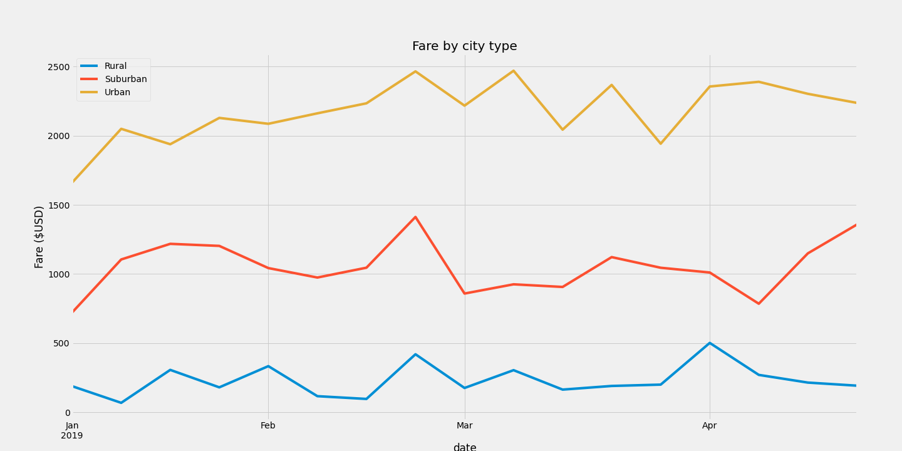

# PyBer_Analysis Challenge

# Overview of the analysis:

Using your Python skills and knowledge of Pandas, you’ll create a summary DataFrame of the ride-sharing data by city type. Then, using Pandas and Matplotlib, you’ll create a multiple-line graph that shows the total weekly fares for each city type. Finally, you’ll submit a written report that summarizes how the data differs by city type and how those differences can be used by decision-makers at PyBer.

## Deliverable 1: A ride-sharing summary DataFrame by city type

 Results:

 Rural cities have the lowest total fares ($4,327.93), total drivers (78), and total rides (125), but the highest average fare per ride ($34.62), and the highest average fare per driver ($55.49).

 Urban cities have the highest total fares ($39,854.38), total drviers (2,405), and total rides (1,625), but have the lowest average fare per ride ($24.53) and lowest average fare per driver ($16.57)

 Suburban cities are in the middle of all metrics, with $19,356.33 total fares, 490 total drivers, and 625 total rides, with $30.97 average fare per ride and $39.50 average fare per driver. 

## Deliverable 2: A multiple-line chart of total fares for each city type

The chart below shows the total fare $ by city type.

## Deliverable 3: A written report

 Recommendations:

 1) Have less drivers in urban cities. There are more drivers than there were total rides in urban cities. Increased competition among existing drivers for the limited number of rides may be reducing the average fare earned per ride.

 2) Advertise more heavily in rural areas to increase total number of fares. These are the highest earning and need to be pursued more aggressively.

 3) 
